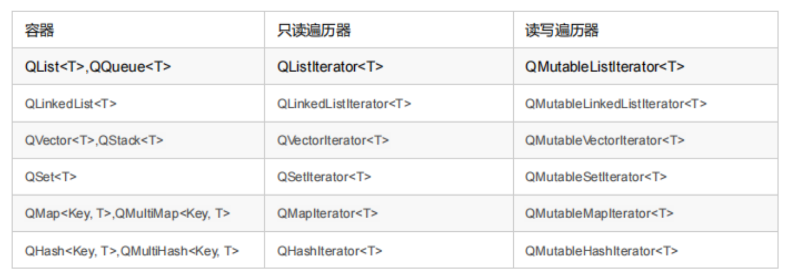
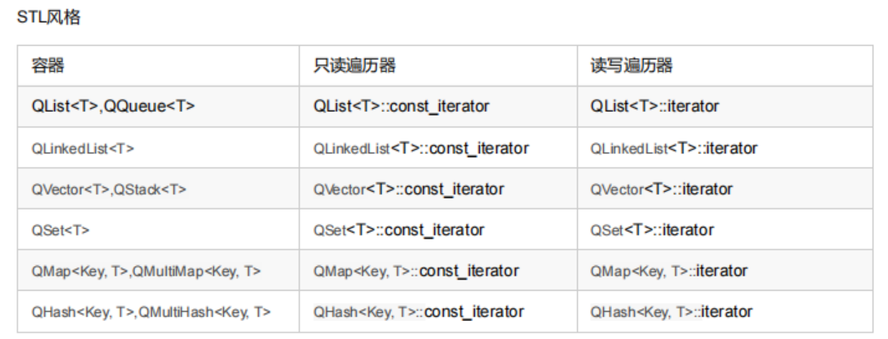

# 元对象系统
组成：QObject基类、Q_OBJECT宏、MOC元对象编译器

#### 获得关联元对象  QObject::metaObject()
`QObject::metaObject()` 函数返回类关联的元对象, QMetaObject 包含了访问元对象的函数。

```cpp
QObject *obj = new QPushButton; // 派生类对象转换为基类指针
obj->metaObject()->className();
```

1. `QMetaObject::newInstance()` 函数创建类的一个新的实例。
2. `QObject::inherits(const char*className)` 函数判断一个对象实例是否是名称为className的
类或QObject的子类的实例。
    ```cpp
    QTimer *timer = newQTimer;
    timer->inherits("QTimer");
    timer->inherits("QObject");
    timer->inherits("QAbstractButton"); // 返回 false, 不是QAbstractButton的子类
    ```

3. `qobject_cast()` 函数 (dynamic cast)。
    ```cpp
    // 子类转父类
    QObject *obj = new QMyWidget; // 等价于 
    QWidget *widget = qobject_cast<QWidget *>(obj);
    // 父类转子类
    QMyWidget *myWidget = qobject_cast<QMyWiidget *>(obj);
    ```


#### Q_PROPERTY 宏
Q_PROPERTY 的作用：为一个变量 指定 getter、setter 函数（可读可写）、变量类型等，极其类似Java的反射+getter、setter函数那一套机制。

`Q_PROPERTY(type name READ getter WRITE setter NOTIFY signal)`

其中，type表示属性的类型，name表示属性的名称，getter和setter表示读取和设置属性的方法，signal表示当属性值发生变化时发出的信号。
使用q_property定义的属性可以通过类的对象实例进行访问和修改。例如，对于以下Person类：
```cpp
class Person : public QObject
{
    Q_OBJECT
    Q_PROPERTY(QString name READ name WRITE setName NOTIFY nameChanged)
public:
    explicit Person(QObject *parent = nullptr);
    QString name() const;
    void setName(const QString &name);
signals:
    void nameChanged();
private:
    QString m_name;
};
```
可以使用以下代码访问和修改Person对象的name属性
```cpp
Person person;
person.setName("Tom");
QString name = person.name();
```

#### connect() 2类函数原型
```cpp
// 1.connect(*Senderobj, &SenderClass::signal Method, "Receiveobj. &ReceiveClass::slotMethod)

不要求slot函数必须是槽函数,可以是private,也可以是public类型。
假如signalMethod与slotMethod(inta)有参数,在connect中则比不必写参数,只用写函数名即可。
connect(ui->pushButton, &QPushButton::clicked,this, &MaainWindow::clickkkk);

// 2.connect(*SenderObj, SIGNAL(signalMethod()), *ReceiveObj, SLOTT(slotMethod()))
格式必须统一,slotMethod()必须定义为publicslots:或者privateslots:槽函数。如果slotMethod(int arg),带有参数,则在connect函数里,也必须带上参数。
connect(ui->pushButton, SIGNAL(clicked()), this, SLOT(clickkkk()));

// 3 直接嵌入匿名函数
connect(ui->pushButton, &QPushButton::clicked, this, [=](){ui->label->setText("112");});
```

#### connect() 的最后一个参数 Qt::ConnectionType type

枚举类型Qt::ConnectionType表示了信号与槽之间的关联方式。

Qt::AutoConnection(缺省值):如果信号的接收者与发射者在同一个个线程,就使用Qt::DirectConnection方式;
否则使用Qt::QueuedConnection方式,在信号为发射时自动确定关联方式。

Qt::DirectConnection:信号被发射时槽函数立即执行,槽函数与信号在同一个线程。

Qt::QueuedConnection:在事件循环回到接收者线程后执行槽函数,槽函数与信号在不同的线程。

Qt::BlockingQueuedConnection:与Qt::QueuedConnection相似,只是信号线程会阻塞直到槽函数执行完毕。当信号与槽函数在同一个线程时绝对不能使用这种方式,否则会造成死锁。

#### 使用sender()获得信号发射者
同时定义多个控件时，用sender区分当前使用的是哪个控件。
```cpp
// 自定义两个按钮
    QPushButton *btnAdd = new QPushButton(this);
    btnAdd->setText(QStringLiteral("Add Data "));

    QPushButton *btnDel = new QPushButton(this);
    btnDel->setGeometry(QRect(0, 100, 100, 50));
    btnDel->setText(QStringLiteral("Del Data "));

    connect(btnAdd, &QPushButton::clicked, this, &MainWindow::btnAddClick);
    connect(btnDel, &QPushButton::clicked, this, &MainWindow::btnAddClick);

    // 打印出按钮地址
    qDebug() << "Add Addr:"<< btnAdd << "Del Addr:" << btnDel;

void MainWindow::btnAddClick()
{
    // 获取是那个按钮点击了
    QPushButton *obj = qobject_cast<QPushButton *>(sender());
    // 打印出按钮地址
    qDebug() << obj;
}
```

#### 自定义信号 emit
在自己设计的类里也可以自定义信号,信号就是在类定义里声明的一个函数,但是这个函数无需实现,只需发射(emit)。信号函数必须是无返回值的函数,但是可以有输入参数。信号函数无需实现,只需在某些条件下发射信号。例如,在incAge()函数中发射信号,其代码如下。

```cpp
class QPerson : public QObject
{
    Q_OBJECT
private:
    int  m_age=10;
    QString m_name;
    int     m_score=79;
public:
    explicit QPerson(QString fName, QObject *parent = nullptr);
    int     age();
    void    setAge(int value);
    void    incAge();
signals:
    void    ageChanged( int  value); // 定义一个信号ageChanged(int) 信号函数无需实现 必须是 void 函数
public slots:
};

void QPerson::incAge()
{
    m_age++;
    emit ageChanged(m_age); // 发射信号
}
```
在incAge()函数里，发射信号ageChanged(int)。至于是否有与此信号相关联的槽函数,信号发射者并不管。如果在使用QPerson类对象的程序中为此信号关联了槽函数,在incAge()函数里发射此信号时,就会执行相关联的槽函数。

#### 例3 见sample3

# 容器类
## 顺序容器
QList、QLinkedList、QVector 接口方法基本相同。QList为数组实现的列表，QLinkedList为链式链表，QVector 为扩容数组
QStack、QQueue：简单不介绍

## 关联容器
QSet、QHash、QMultiHash 哈希 O(1)
QMap、QMultiMap 红黑树 O(Log N)

```cpp
void testQSet() {
    QSet<QString> set {"111", "333", "222"}; // 哈希 O(1) 无序
    for (auto & s : set) qDebug() << s << "\n";
}

void tesQMap() {
     // QMap 提供 <
    QSet<QString> set {"111", "333", "222"};
    QSet<QString> set2 {"-1"};
    QMap<QString, QSet<QString>> map {{"b", set}, {"a", set2}};
    // 按照 key-val 添加进map的顺序而不是以key作为红黑树的比较键值（有些不实用）
    for (auto & key : map.keys()) {
        qDebug() << map[key] << "\n";
    }
    map.remove("b");
    QSet<QString> tmp = map.value("a");
}

void testQMultiMap() {
    // QMultiMap 是 QMap 子类
    QMultiMap<QString, int> m1 {{"1", 1}};
    QMultiMap<QString, int> m2 {{"2", 2}};
    QMultiMap<QString, int> m3 {{"1", 3}};

    m3 += m1 + m2;
    qDebug() << m3.size() << "\n";

    // 没有 [] 运算符
    QList<int> res = m3.values("1"); // 键"1"的所有value
    for (auto & x : res) qDebug() <<  x << " "; // 1 , 3
}

void testQHash() {
     // QHash 提供 == 和 qHash() ，和 c++ Java 一个套路
    QSet<QString> set {"111", "333", "222"};
    QSet<QString> set2 {"-1"};
    QHash<QString, QSet<QString>> hash {{"b", set}, {"a", set2}}; // 哈希 O(1) 无序 类似 QMap
    for (auto & key : hash.keys()) {
        qDebug() << hash[key] << "\n";
    }
}

void testQMultiHash() {
    // QMultiHash 是 QHash 子类
    QMultiHash<QString, int> m1 {{"1", 1}};
    QMultiHash<QString, int> m2 {{"2", 2}};
    QMultiHash<QString, int> m3 {{"1", 3}};

    m3 += m1 + m2;
    qDebug() << m3.size() << "\n";

    // 没有 [] 运算符
    QList<int> res = m3.values("1"); // 键"1"的所有value
    for (auto & x : res) qDebug() <<  x << " "; // 1 , 3
}
```

## 2类迭代器：Java慢、STL快


强调一点：如果迭代器只读不写，务必使用 const_iterator 或者 QMutable ，因为它们更快。

## foreach
```cpp
    QSet<QString> set {"111", "333", "222"};

    QString tmp;
    foreach (tmp, set)  qDebug() << tmp << "\n";

    foreach (auto & s, set)  qDebug() << s << "\n";
```
