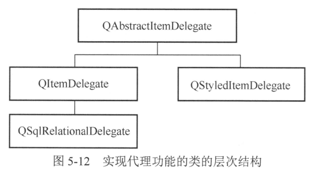

## Delegate 代理
在 QStandardItemModel.md 中，是一个二维表格，每一列的数据类型是不同的，比如：
第1列是 int 
第4列是 qreal 浮点

但在QStandardItemModel的例子中，我们都是用 QLineEdit 字符串组件来显示和编辑的。
这是因为，对于一个Model，如果不指定 Delegate ，缺省是 QLineEdit。

第1列是 int ，QSpinBox 更合适
第4列是 qreal 浮点，QDoubleSpinBox 更合适



QAbstractItemDelegate是所有代理类的抽象基类,QStyledItemDelegate是视图组件使用的缺省的代理类,QItemDelegate也是类似功能的类。
QStyledItemDelegate与QItemDelegate的差别在于:QStyledItemDelegate可以使用当前的样式表设置来绘制组件,因此建议使用QStyledItem Delegate作为自定义代理组件的基类。

不管从QStyledItemDelegate还是QItemDelegate继承设计自定义代理组件,都必须实现如下的4个函数:

1. createEditor()函数创建用于编辑模型数据的widget组件,如一个QSSpinBox组件,或一个QComboBox组件
2. setEditorData()函数从数据模型获取数据,供widget组件进行编辑
3. setModelData()将 widget上的数据模型
4. updateEditorGeometry()用于给widget组件设置一个合适的大小

## 实现自定义 代理类
以书中 5.5.3 为例，总结一下基本流程：
1. 新建自定义代理类 xxx.h xxx.cpp【class xxx : public QStyledItemDelegate】，继承 QStyledItemDelegate
2. 实现上面那 4个函数，函数原型是固定的，看下面代码
```cpp
// 自定义代理类 QWIntSpinDelegate , 其作用是 基于 int 类型的组件QSpinBox
class QWIntSpinDelegate : public QStyledItemDelegate
{
    Q_OBJECT
public:
    QWIntSpinDelegate(QObject *parent=0);

//自定义代理组件必须继承以下4个函数
//创建编辑组件
    QWidget *createEditor(QWidget *parent, const QStyleOptionViewItem &option, const QModelIndex &index) const Q_DECL_OVERRIDE;
//从数据模型获取数据，显示到代理组件中
    void setEditorData(QWidget *editor, const QModelIndex &index) const Q_DECL_OVERRIDE;
//将代理组件的数据，保存到数据模型中
    void setModelData(QWidget *editor, QAbstractItemModel *model, const QModelIndex &index) const Q_DECL_OVERRIDE;
//更新代理编辑组件的大小
    void updateEditorGeometry(QWidget *editor, const QStyleOptionViewItem &option, const QModelIndex &index) const Q_DECL_OVERRIDE;
};
```

```cpp
/*
createEditor()函数用于创建需要的编辑组件,QWIntSpinDelegate类希望创建一个QSpinBox作为编辑组件,
创建一个QSpinBox类型的编辑器editor,parent指向视图组件;然后对创建的editor做一些设置,将editor作为函数的返回值。
*/
QWidget *QWIntSpinDelegate::createEditor(QWidget *parent, const QStyleOptionViewItem &option, const QModelIndex &index) const
{ //创建代理编辑组件
    Q_UNUSED(option);
    Q_UNUSED(index);

    QSpinBox *editor = new QSpinBox(parent); //创建一个QSpinBox
    editor->setFrame(false); //设置为无边框
    editor->setMinimum(0);
    editor->setMaximum(10000);

    return editor;  //返回此编辑器
}
```

```cpp
// setEditorData()函数用于从数据模型获取数值,设置为编辑器的显示值。当双击一个单元格进入编辑状态时,就会自动调用此函数
void QWIntSpinDelegate::setEditorData(QWidget *editor, const QModelIndex &index) const
{//从数据模型获取数据，显示到代理组件中
//获取数据模型的模型索引指向的单元的数据
    int value = index.model()->data(index, Qt::EditRole).toInt();

    QSpinBox *spinBox = static_cast<QSpinBox*>(editor);  //强制类型转换
    spinBox->setValue(value); //设置编辑器的数值
}
// 函数传递来的参数editor指向代理编辑组件, index是关联的为数据单元的模型索引
// 通过强制类型转换将editor转换为QSpinBox类型组件spinBox, 然后将获取的数值设置为spinBox的值。

```


```cpp
void QWIntSpinDelegate::setModelData(QWidget *editor, QAbstractItemModel *model, const QModelIndex &index) const
{ //将代理组件的数据，保存到数据模型中
    QSpinBox *spinBox = static_cast<QSpinBox*>(editor); //强制类型转换
    spinBox->interpretText(); //解释数据，如果数据被修改后，就触发信号
    int value = spinBox->value(); //获取spinBox的值

    model->setData(index, value, Qt::EditRole); //更新到数据模型
}

void QWIntSpinDelegate::updateEditorGeometry(QWidget *editor, const QStyleOptionViewItem &option, const QModelIndex &index) const
{ //设置组件大小
    Q_UNUSED(index);
    editor->setGeometry(option.rect);
}
```

## 在代码中 使用自定义代理类
```cpp
class MainWindow : public QMainWindow
{
    Q_OBJECT
private:
    QWIntSpinDelegate intSpinDelegate; //整型数
}
```

在构造函数中，将QTableView的某些列设置代理【这样就不会使用缺省参数QLineEdit】
`tableView->setItemDelegateForColumn(col列号, &你的代理类对象取地址)` 即可使用自定义代理类
```cpp
MainWindow::MainWindow(QWidget *parent) :QMainWindow(parent), ui(new Ui::MainWindow)
{
    ui->setupUi(this);
    theModel = new QStandardItemModel(2,FixedColumnCount,this); //创建数据模型
    theSelection = new QItemSelectionModel(theModel);//Item选择模型
    ui->tableView->setModel(theModel); //设置数据模型
    ui->tableView->setSelectionModel(theSelection);//设置选择模型

//为各列设置自定义代理组件
    ui->tableView->setItemDelegateForColumn(0,&intSpinDelegate);  //测深，整数
    ui->tableView->setItemDelegateForColumn(1,&floatSpinDelegate);  //浮点数
    ui->tableView->setItemDelegateForColumn(2,&floatSpinDelegate); //浮点数
    ui->tableView->setItemDelegateForColumn(3,&floatSpinDelegate); //浮点数
    ui->tableView->setItemDelegateForColumn(4,&comboBoxDelegate); //Combbox选择型
}
```
