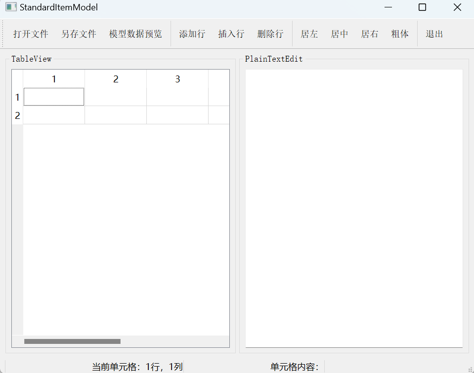
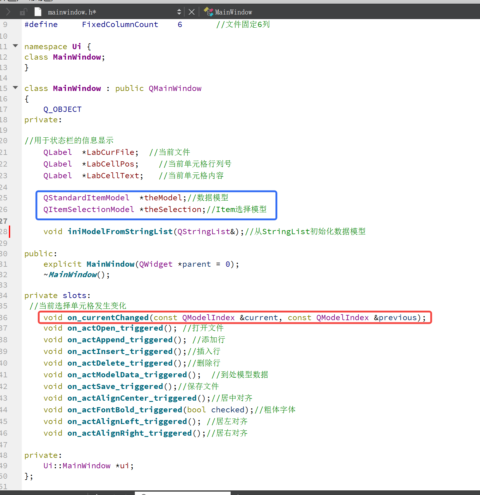
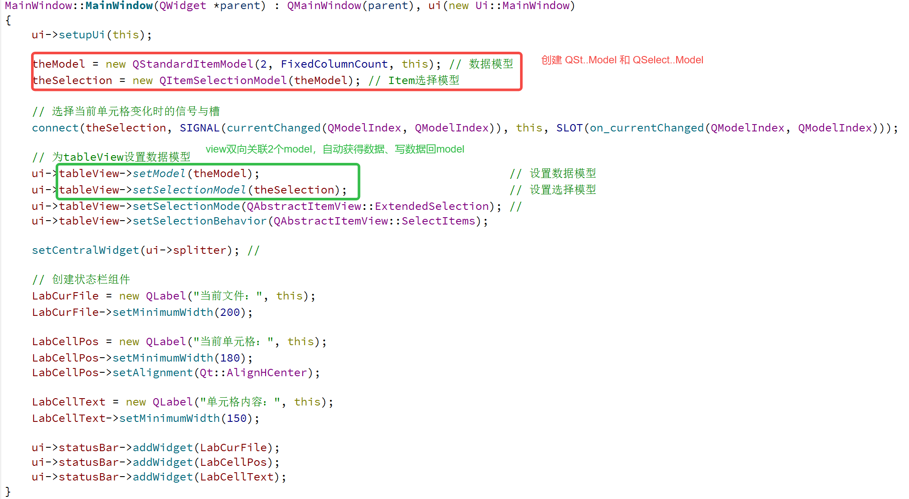

## QStandardItemModel

QStandardItemModel 可以保存任何类型的内容，比如文本。
QStandardItemModel 是一种二维表格的形式的 dataModel ， 所以通常与 QTableView 【二维表格视图】关联使用。
QItemSelectionModel 是一种特殊的 model ， 它的作用是，当鼠标选中【视图表格】里的【某单元格】时，QItemSelectionModel 可以获得【被选中单元格】的 (i, j) 行列坐标。

《QT 5.9开发手册》里面的例子 sample5_3 非常好，阅读编写代码，观察了这个例子的UI效果。
挑选其中的有实际用处的 QStandardItemModel 技巧。

#### 第一个类 MainWindow.h  重点是 颜色框。


#### 构造函数 MainWindow.cpp


#### 从 txt 中导入二维形式的 字符串数据
```cpp
void MainWindow::on_actOpen_triggered()
{                                                             // 打开文件
    QString curPath = QCoreApplication::applicationDirPath(); // 获取应用程序的路径
    // 调用打开文件对话框打开一个文件
    QString aFileName = QFileDialog::getOpenFileName(this, "打开一个文件", curPath, "井数据文件(*.txt);;所有文件(*.*)");
    if (aFileName.isEmpty())
        return; // 如果未选择文件，退出

    QStringList fFileContent;                              // 文件内容字符串列表
    QFile aFile(aFileName);                                // 以文件方式读出
    if (aFile.open(QIODevice::ReadOnly | QIODevice::Text)) // 以只读文本方式打开文件
    {
        QTextStream aStream(&aFile); // 用文本流读取文件
        ui->plainTextEdit->clear();  // 清空
        while (!aStream.atEnd())
        {
            QString str = aStream.readLine();        // 读取文件的一行
            ui->plainTextEdit->appendPlainText(str); // 添加到文本框显示
            fFileContent.append(str);                // 添加到 StringList
        }
        aFile.close(); // 关闭文件

        this->LabCurFile->setText("当前文件：" + aFileName); // 状态栏显示
        ui->actAppend->setEnabled(true);                     // 更新Actions的enable属性
        ui->actInsert->setEnabled(true);
        ui->actDelete->setEnabled(true);
        ui->actSave->setEnabled(true);

        iniModelFromStringList(fFileContent); // 从StringList的内容初始化数据模型
    }
}
```
有用的技巧：
1. 获得exe路径： QCoreApplication::applicationDirPath()
2. 单出文件选择对话框： QFileDialog::getOpenFileName 返回 QString
3. 创建 QFile(QString) 对象 aFile，用于读取文件
4. aFile.open 打开文件，形参指定 打开方式
5. QTextStream aStream(&aFile) 配合 while (!aStream.atEnd()) 配合 QString str = aStream.readLine() 读取每行
6. QAction 对象 可以设置 setEnabled，即此时动作可以执行

#### QStringList 的数据赋值给 model
```cpp
void MainWindow::iniModelFromStringList(QStringList &aFileContent)
{                                      // 从一个StringList 获取数据，初始化数据Model
    int rowCnt = aFileContent.count(); // 文本行数，第1行是标题
    theModel->setRowCount(rowCnt - 1); // 实际数据行数

    // 设置表头
    QString header = aFileContent.at(0); // 第1行是表头
    // 一个或多个空格、TAB等分隔符隔开的字符串， 分解为一个StringList
    QStringList headerList = header.split(QRegExp("\\s+"), QString::SkipEmptyParts);
    theModel->setHorizontalHeaderLabels(headerList); // 设置表头文字

    // 设置表格数据
    int j;
    QStandardItem *aItem;
    for (int i = 1; i < rowCnt; i++)
    {
        QString aLineText = aFileContent.at(i); // 获取 数据区 的一行
        // 一个或多个空格、TAB等分隔符隔开的字符串， 分解为一个StringList
        QStringList tmpList = aLineText.split(QRegExp("\\s+"), QString::SkipEmptyParts);
        for (j = 0; j < FixedColumnCount - 1; j++)    // tmpList的行数等于FixedColumnCount, 固定的
        {                                             // 不包含最后一列
            aItem = new QStandardItem(tmpList.at(j)); // 创建item
            theModel->setItem(i - 1, j, aItem);       // 为模型的某个行列位置设置Item
        }

        aItem = new QStandardItem(headerList.at(j)); // 最后一列是Checkable,需要设置
        aItem->setCheckable(true);                   // 设置为Checkable
        if (tmpList.at(j) == "0")
            aItem->setCheckState(Qt::Unchecked); // 根据数据设置check状态
        else
            aItem->setCheckState(Qt::Checked);
        theModel->setItem(i - 1, j, aItem); // 为模型的某个行列位置设置Item
    }
}
```
有用的技巧：
1. `QString::split(QRegExp("\\s+"), QString::SkipEmptyParts)` 以 "\\s+" 来切割字符串，返回一个 字符串列表
2. QStandardItemModel 设置表头 `theModel->setHorizontalHeaderLabels(QString)`
3. QStandardItem 标准项可以保存任何数据，比如QString， `aItem = new QStandardItem(QString)`
4. QStandardItemModel 设置某行某列的值 `theModel->setItem(i, j, aItem)`
5. QStandardItem 标准项可以保存任何数据，比如 复选框， `aItem->setCheckState(Qt::Unchecked)`

#### 在 QStandardItemModel 插入一行【常用实用操作】
```cpp
void MainWindow::on_actInsert_triggered()
{                                     // 插入行
    QList<QStandardItem *> aItemList; // QStandardItem的列表类
    QStandardItem *aItem;
    for (int i = 0; i < FixedColumnCount - 1; i++)
    {
        aItem = new QStandardItem("0"); // 新建一个QStandardItem
        aItemList << aItem;             // 添加到列表类
    }

    QString str; // 获取表头文字
    str = theModel->headerData(theModel->columnCount() - 1, Qt::Horizontal, Qt::DisplayRole).toString();
    aItem = new QStandardItem(str); // 创建Item
    aItem->setCheckable(true);      // 设置为可使用CheckBox
    aItemList << aItem;             // 添加到列表类

    QModelIndex curIndex = theSelection->currentIndex(); // 获取当前选中项的模型索引
    theModel->insertRow(curIndex.row(), aItemList);      // 在当前行的前面插入一行
    theSelection->clearSelection();                      // 清除已有选择
    theSelection->setCurrentIndex(curIndex, QItemSelectionModel::Select);
}
```
上面这段代码的流程【有用的技巧】：
1. 先生成从 【0到FixedColumnCount - 2 】 个 QStandardItem 对象，每个 QStandardItem 都是 "0"，这些 QStandardItem 存到 QList 里面
2. QList 最后加入一个 用表头文字QString 初始化的 QStandardItem对象
3. 从 QItemSelectionModel 对象 theSelection 中，获得 鼠标聚焦的 【那一格的(i, j)】`QModelIndex curIndex = theSelection->currentIndex()`
4. `curIndex.row()` 就是鼠标聚焦的那一行
5. QStandardItemModel 插入一行的函数， `theModel->insertRow(row, QList<QStandardItem *>)`
6. 插入后，让鼠标重新聚集到原来那行，
    `theSelection->clearSelection()`
    `theSelection->setCurrentIndex(curIndex, QItemSelectionModel::Select)`

####  QItemSelectionModel 可能选中多个单元格
```cpp
void MainWindow::on_actAlignCenter_triggered()
{ 
    if (!theSelection->hasSelection())return;

    QModelIndexList selectedIndex = theSelection->selectedIndexes(); // 鼠标可能选了多个单元格，所以是一个 List

    QModelIndex aIndex;
    QStandardItem *aItem;

    for (int i = 0; i < selectedIndex.count(); i++)
    {
        aIndex = selectedIndex.at(i);
        aItem = theModel->itemFromIndex(aIndex);
        aItem->setTextAlignment(Qt::AlignHCenter); // 文字居中对齐
    }
}
```
1. `theSelection->selectedIndexes() 返回 QModelIndexList` ，多个单元格，list 里面的对象是 QModelIndex
2. `list.at(i)` 拿到 QModelIndex
3. QStandardItemModel 使用含函数 itemFromIndex(QModelIndex) 可以获得 某个单元格，返回 QStandardItem
4. 对 QStandardItem 设置居中 `aItem->setTextAlignment(Qt::AlignHCenter)`