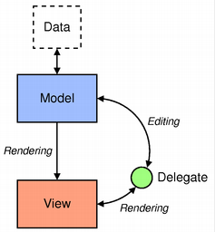
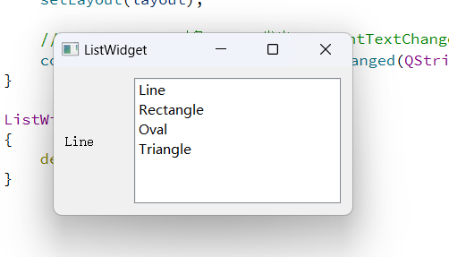
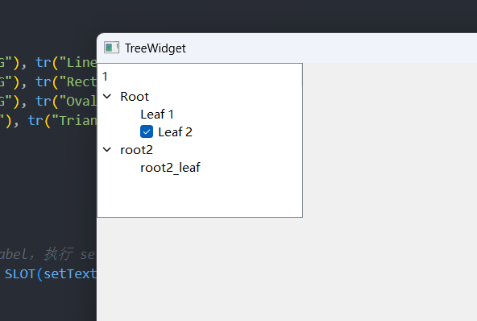
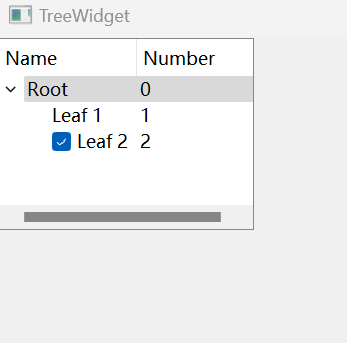
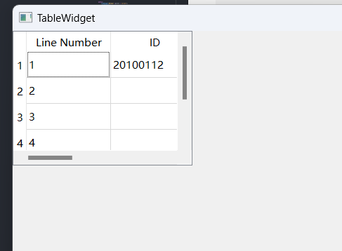
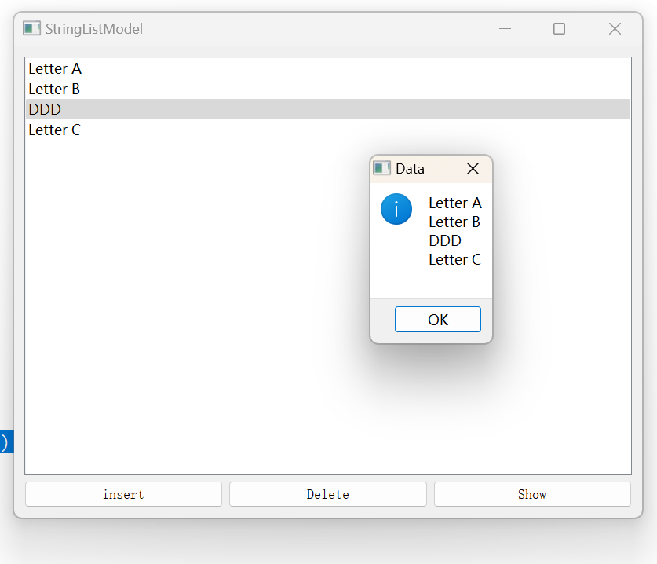
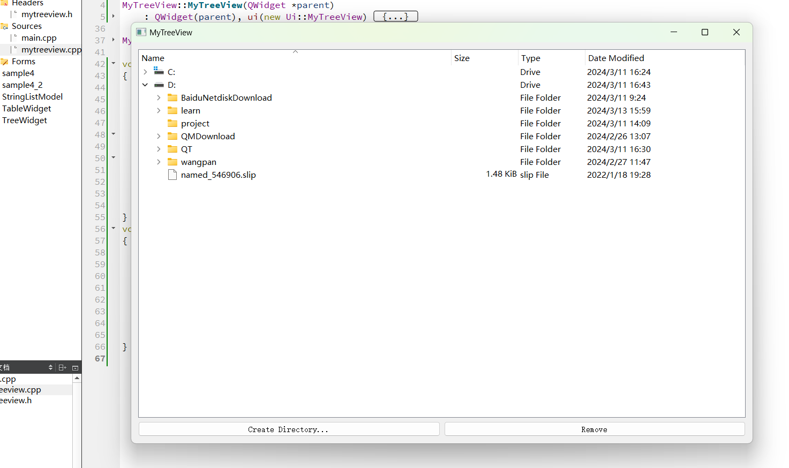
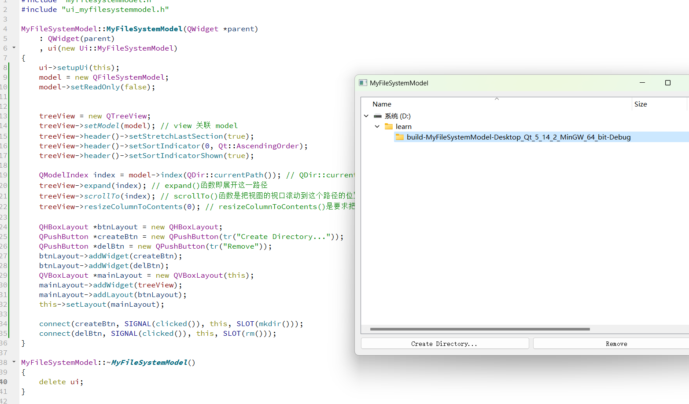

# Model / View
由于用Java+HTML开发过 MVC 的前后端不分离的网站，也用 Java+Vue开发过 MC 前后端分离的网站，在此不再赘述 QT 的 MV概念。


> 对于 Qt 而言，它使用的是一个类似于 MVC 模型的 model-view 架构。其中，model 就相当于 MVC架构中的 model，而对于控制器部分，Qt 使用的是另外的一种抽象，代理 delegate。代理被用来提供对 item 渲染和编辑的控制。对于每种视图，Qt 都提供了一个默认的代理，对于大多数应用来说，我们只需要使用这个默认的代理即可。

>使用 Qt 的 model-view 架构，我们可以让 model 是取回 view 所要展示的数据，这样就可以在不降低性能的情形下处理大量数据。并且你可以把一个 model 注册给多个 view，让这些 view 能够显示同样的数据，也就是为同一个数据提供不同的显示方式。Qt 会自动地对这些 view 保持同步，自动刷新所有的 view 以显示最新的数据。这样，我们就可以只对 model 进行修改，view 会自动更新。

>在少量数据的情形下，我们不需要动用 model 这样重量级的组件。Qt 为了方便起见也提供了 item view 类，分别是 QListWidget，QTableWidget 和 QTreeWidget，使用这些类可以直接对 item 进行操作。这种实现很像 Qt 早期版本，组件中包含了相应的 item，例如 QTableWidget 中包含有QTableWidgetItem 等。但是对于很大的数据，我们则需要使用 Qt 的 view 类，比如 QListView，QTabelView 和 QTreeView，同时需要提供一个 model，可以是自定义 model，也可以是 Qt 预置的model。例如，如果数据来自数据库，那么你可以使用 QTabelView 和 QSqlTableModel 这两个类。

## QListWidget 
视图效果为竖着或横着的列表。
这个类为我们展示一个 List 列表的视图。下面的代码很简单不解释
```cpp
class ListWidget : public QWidget
{
    Q_OBJECT
public:
    ListWidget(QWidget *parent = nullptr);
    ~ListWidget();
private:
    QLabel *label;
    QListWidget *list; // 

    Ui::ListWidget *ui;
};
ListWidget::ListWidget(QWidget *parent): QWidget(parent), ui(new Ui::ListWidget)
{
    ui->setupUi(this);
    label = new QLabel;
    label->setFixedWidth(70);
    list = new QListWidget;
    list->addItem(new QListWidgetItem(QIcon(":/images/line.PNG"), tr("Line")));
    list->addItem(new QListWidgetItem(QIcon(":/images/rect.PNG"), tr("Rectangle")));
    list->addItem(new QListWidgetItem(QIcon(":/images/oval.PNG"), tr("Oval")));
    list->addItem(new QListWidgetItem(QIcon(":/images/tri.PNG"), tr("Triangle")));
    QHBoxLayout *layout = new QHBoxLayout;
    layout->addWidget(label);
    layout->addWidget(list);

    setLayout(layout);

    // QListWidget 对象 list 发出 currentTextChanged 信号 到 label，执行 setText槽函数
    connect(list, SIGNAL(currentTextChanged(QString)), label, SLOT(setText(QString)));
}
```



## QTreeWidget
视图效果为 单列或多列 的树【QTreeWidget】，树下面套子树【QTreeWidgetItem】，子树下面套子树【QTreeWidgetItem】。
```cpp
class TreeWidget : public QWidget
{
    Q_OBJECT

public:
    TreeWidget(QWidget *parent = nullptr);
    ~TreeWidget();

private:
    QTreeWidget *tree; //
    Ui::TreeWidget *ui;
};

TreeWidget::TreeWidget(QWidget *parent) : QWidget(parent), ui(new Ui::TreeWidget)
{
    ui->setupUi(this);
    tree = new QTreeWidget(this);
    tree->setColumnCount(1);

    QTreeWidgetItem *root = new QTreeWidgetItem(tree, QStringList(QString("Root")));
    QTreeWidgetItem *leaf = new QTreeWidgetItem(root, QStringList(QString("Leaf 1")));
    QTreeWidgetItem *leaf2 = new QTreeWidgetItem(root, QStringList(QString("Leaf 2")));
    leaf2->setCheckState(0, Qt::Checked);

    root->addChild(leaf);
    root->addChild(leaf2);

    QTreeWidgetItem *root2 = new QTreeWidgetItem(tree, QStringList(QStri("root2")));            // 父节点是 tree 【QTreeWidget】
    QTreeWidgetItem *root2_leaf = new QTreeWidgetItem(root2, QStringList(QString("root2_leaf"))); // 父节点是 root2 【QTreeWidgetItem】
    root2->addChild(root2_leaf);

    // 解释：QTreeWidget对象tree是树的总节点，这个总节点下面可以有多个子树【每个子树节点都是QTreeWidgetItem】
    // 最后，把多个子树的头节点【比如root、root2】放在一个QList里面
    // insertTopLevelItems方法把QList插入
    QList<QTreeWidgetItem *> rootList;
    rootList << root << root2;
    tree->insertTopLevelItems(0, rootList);
}
```

在构造函数创建 QTreeWidget 对象tree。调用 setColumnCount()函数设定列数。
QTreeWidgetItem 的构造函数原型
`QTreeWidgetItem::QTreeWidgetItem(QTreeWidget *parent, const QStringList &strings, int type = Type);`
然后中间的 QTreeWidgetItem 的逻辑很简单不解释【对着效果图一看就懂】
最后一步，我们创建了一个 QList 类型，前面的 root 、root2 添加进去，然后 insert 到 top items。这里可以想象到，由于这个树组件可以由多个根组成，所以我们传进来的是一个 list。

效果图顶部多出来的1其实是 QTreeWidget 的 HeaderLabels 属性，可以隐藏，看下面这个例子

#### QTreeWidget 例2
```cpp
TreeWidget::TreeWidget(QWidget *parent) : QWidget(parent), ui(new Ui::TreeWidget)
{
    ui->setupUi(this);
    tree = new QTreeWidget(this);
    tree->setColumnCount(2);

    QStringList headers {"Name", "Number"};
    tree->setHeaderLabels(headers);

    QStringList rootTextList {"Root", "0"};
    QTreeWidgetItem *root = new QTreeWidgetItem(tree, rootTextList);

    QStringList leafTextList {"Leaf 1", "1"};
    QTreeWidgetItem *leaf = new QTreeWidgetItem(root, leafTextList);
    root->addChild(leaf);

    QStringList leaf2TextList {"Leaf 2", "2"};
    QTreeWidgetItem *leaf2 = new QTreeWidgetItem(root, leaf2TextList);
    leaf2->setCheckState(0, Qt::Checked);
    root->addChild(leaf2);

    QList<QTreeWidgetItem *> rootList;
    rootList << root;
    tree->insertTopLevelItems(0, rootList);
}
```


## QTableWidget
```cpp
class TableWidget : public QWidget
{
private:
    QTableWidget *table;
};
TableWidget::TableWidget(QWidget *parent): QWidget(parent), ui(new Ui::TableWidget)
{
    ui->setupUi(this);
    table = new QTableWidget(this);
    table->setColumnCount(3);
    table->setRowCount(5);
    QStringList headers;
    headers << "Line Number" << "ID" << "Name" << "Age" << "Sex";
    table->setHorizontalHeaderLabels(headers);
    table->setItem(0, 0, new QTableWidgetItem(QString("1")));
    table->setItem(1, 0, new QTableWidgetItem(QString("2")));
    table->setItem(2, 0, new QTableWidgetItem(QString("3")));
    table->setItem(3, 0, new QTableWidgetItem(QString("4")));
    table->setItem(4, 0, new QTableWidgetItem(QString("5")));
    table->setItem(0, 1, new QTableWidgetItem(tr("20100112")));
}
```

首先创建了 QTableWidget 对象，然后设置列数和行数。接下来使用一个QStringList，把每一列的标题设置了一下。然后调用 addItem()函数。这个函数前两个参数分别是行row 和列 col，然后第三个参数构建一个 QTableWidgetItem 对象，这样，Qt 就会把这个对象放在第 row 行第 col 列的单元格里面。注意，这里的行和列都是从0开始的。

## QStringListModel
QStringListModel 就是封装了 QStringList 的 model。QStringList 是一种很常用的数据类型，它实际上是一个字符串列表。我们可以想象，对于一个 list 来说，如果提供一个字符串列表形式的数据，就应该能够把这个数据展示出来。因为二者是一致的：QStringList 是线性的，而list 也是线性的。所以，QStringListModel 很多时候都会作为 QListView 的 model。

```cpp
class StringListModel : public QWidget
{
    Q_OBJECT
private:
    QStringListModel *model; // model
    QListView *listView; // 视图
private slots:
    void insertData();
    void deleteData();
    void showData();
};
StringListModel::StringListModel(QWidget *parent) : QWidget(parent), ui(new Ui::StringListModel)
{
    // 这部分代码逻辑简单，看效果图一目了然
    ui->setupUi(this);
    QStringList data;
    data << "Letter A" << "Letter B" << "Letter C";


    listView = new QListView(this); // 创建 QListView
    model = new QStringListModel(this); // 创建 QStringListModel
    model->setStringList(data); // model 初始化原始值 A B C
    listView->setModel(model); // View 关联 model

    QPushButton *insertBtn = new QPushButton(tr("insert"), this);
    QPushButton *delBtn = new QPushButton(tr("Delete"), this);
    QPushButton *showBtn = new QPushButton(tr("Show"), this);

    QHBoxLayout *btnLayout = new QHBoxLayout;
    btnLayout->addWidget(insertBtn);
    btnLayout->addWidget(delBtn);
    btnLayout->addWidget(showBtn);
    QVBoxLayout *mainLayout = new QVBoxLayout(this);
    mainLayout->addWidget(listView);
    mainLayout->addLayout(btnLayout);
    this->setLayout(mainLayout);

    connect(insertBtn, SIGNAL(clicked()), this, SLOT(insertData()));
    connect(delBtn, SIGNAL(clicked()), this, SLOT(deleteData()));
    connect(showBtn, SIGNAL(clicked()), this, SLOT(showData()));
}
```
只是把 QStringListModel 设置为 QListView 的 model，QListView 就已经可以把 model 里面的数据展示出来了。
```cpp
void StringListModel::insertData()
{
    bool isOK;
    QString text = QInputDialog::getText(NULL, "Insert", "Please input new data:", QLineEdit::Normal, "You are inserting new data.", &isOK);
    if (isOK)
    {
        int row = listView->currentIndex().row(); // 鼠标焦点所在的那一行
        model->insertRows(row, 1);                // 在这一行下面插入1行
        QModelIndex index = model->index(row);
        model->setData(index, text);
        listView->setCurrentIndex(index);
        listView->edit(index);
    }
}
void StringListModel::deleteData()
{
    if (model->rowCount() > 1) model->removeRows(listView->currentIndex().row(), 1);
}
void StringListModel::showData()
{
    QStringList data = model->stringList();
    QString str;
    foreach (QString s, data) str += s + "\n";
    QMessageBox::information(this, "Data", str);
}
```
使用 QInputDialog::getText()函数要求用户输入数据。
使用 listView()->currentIndex()函数，获取 QListView当前行【鼠标焦点所在的那一行】。这个函数的返回值是一个 QModelIndex 类型。
QModelIndex 类保存了三个数据：行、列以及属于哪一个 model。调用其 row()函数获得行，这个返回值是一个 int，也就是第几行。
调用 insertRows(row, 1) 函数，在当前的 row 行插入 count 行，这里的 count = 1。
使用 model 的 index()函数获取当前行的 QModelIndex 对象，使用 setData()函数把我们用 QInputDialog 接受的数据插入。
调用 edit()函数，这个函数使得这一行可以被编辑。

## QDirModel

```cpp
class MyTreeView : public QWidget
{
private:
    QDirModel *model;
    QTreeView *treeView;
    Ui::MyTreeView *ui;
private slots:
    void mkdir();
    void rm();
};
MyTreeView::MyTreeView(QWidget *parent): QWidget(parent), ui(new Ui::MyTreeView)
{
    ui->setupUi(this);
    model = new QDirModel;
    model->setReadOnly(false);
    model->setSorting(QDir::DirsFirst | QDir::IgnoreCase | QDir::Name); // 排序规则

    treeView = new QTreeView;
    treeView->setModel(model); // view 关联 model
    treeView->header()->setStretchLastSection(true);
    treeView->header()->setSortIndicator(0, Qt::AscendingOrder);
    treeView->header()->setSortIndicatorShown(true);

    QModelIndex index = model->index(QDir::currentPath()); // QDir::currentPath()获取当前 exe 文件运行时路径，并把这个路径当成程序启动时显示的路径。
    treeView->expand(index); // expand()函数即展开这一路径
    treeView->scrollTo(index); // scrollTo()函数是把视图的视口滚动到这个路径的位置
    treeView->resizeColumnToContents(0); // resizeColumnToContents()是要求把列头适应内容的宽度，也就是不产生...符号

    QHBoxLayout *btnLayout = new QHBoxLayout;
    QPushButton *createBtn = new QPushButton(tr("Create Directory..."));
    QPushButton *delBtn = new QPushButton(tr("Remove"));
    btnLayout->addWidget(createBtn);
    btnLayout->addWidget(delBtn);
    QVBoxLayout *mainLayout = new QVBoxLayout(this);
    mainLayout->addWidget(treeView);
    mainLayout->addLayout(btnLayout);
    this->setLayout(mainLayout);

    connect(createBtn, SIGNAL(clicked()), this, SLOT(mkdir()));
    connect(delBtn, SIGNAL(clicked()), this, SLOT(rm()));
}
```
构造函数中，首先我们创建了 QDirModel 的一个对象，并且设置 ReadOnly 为 false，也就是说我们可以对其进行修改。而下一个 setSorting()函数是对其进行排序，排序的依据也很清楚：文件夹优先(QDir::DirsFirst)，忽略大小写(QDir::IgnoreCase)，而且是根据名字排序(QDir::Name)。
然后我们创建一个 QTreeView 实例，并且把 model 设置为刚刚的 QDirModel 实例。然后我们开始设置 QTreeView 的相关属性。首先把 stretchLastSection 设置为 true。如果把这个属性设置为true，就是说，当 QTreeView 的宽度大于所有列宽之和时，最后一列的宽度自动扩展以充满最后的边界；否则就让最后一列的宽度保持原始大小。第二个 setSortIndicator()函数是设置哪一列进行排序。由于我们前面设置了 model 是按照名字排序，所以我们这个传递的第一个参数是0，也就是第1列。setSortIndicatorShown()函数设置显示列头上面的排序小箭头。setClickable(true)则允许鼠标点击列头。这样，我们的 QTreeView 就设置完毕了。最后，我们通过 QDir::currentPath()获取当前 exe 文件运行时路径，并把这个路径当成程序启动时显示的路径。expand()函数即展开这一路径；scrollTo()函数是把视图的视口滚动到这个路径的位置；resizeColumnToContents()是要求把列头适应内容的宽度，也就是不产生...符号。这样，我们就通过一系列的参数设置好了 QTreeView，让它能够为我们展示目录结构。

```cpp
void MyTreeView::mkdir()
{
    QModelIndex index = treeView->currentIndex(); // 首先获取选择的目录
    if (!index.isValid()) return; // isValid()的判断很重要 因为默认情况下是没有目录被选择的，此时这个路径是非法的，为了避免程序出现异常，必须要有这一步判断。

    QString dirName = QInputDialog::getText(this, tr("Create Directory"), tr("Directory name")); // 弹出对话框询问新的文件夹名字
    if (!dirName.isEmpty())
    {
        if (!model->mkdir(index, dirName).isValid()) // model->mkdir 创建
        {
            // 创建失败会有提示，否则就是创建成功。
            QMessageBox::information(this, tr("Create Directory"), tr("Failed to create the directory"));
        }
    }
}
void MyTreeView::rm()
{
    QModelIndex index = treeView->currentIndex();
    if (!index.isValid()) return;

    bool ok;
    if (model->fileInfo(index).isDir()) ok = model->rmdir(index); // 目录和文件的删除不是一个函数，需要调用 isDir()函数检测。
    else ok = model->remove(index);

    if (!ok) QMessageBox::information(this, tr("Remove"), tr("Failed to remove %1").arg(model->fileName(index)));
}
```
>注，QDirModel 在最新版 Qt 中已经不建议使用了。文档中说使用 QFileSystemModel 代替。由于这两者的函数几乎一样，所以就没有对代码进行修改。与 QDirModel 不同的是，QFileSystemModel会启动自己的线程进行文件夹的扫描，因此不会发生因扫描文件夹而导致的主线程阻塞的现象。另外，无论 QDirModel 还是 QFileSystemModel 都会对 model 结果进行缓存，如果你要立即刷新结果，前者提供了 refresh()函数，而后者会通知 QFileSystemWatcher 类。用于获取磁盘文件目录的数据模型类还有一个QDirModel,QDiriModel的功能与QFileSystemModel类似,也可以获取目录和文件,但是QFileSystemModel采用单独的约线程获取目录文件结构,而QDirMode不使用单独的线程。使用单独的线程就不会阻碍主线程,所以推荐使用QFileSystemModel。

## QFileSystemModel 与 QDirModel 的代码没有任何不同



