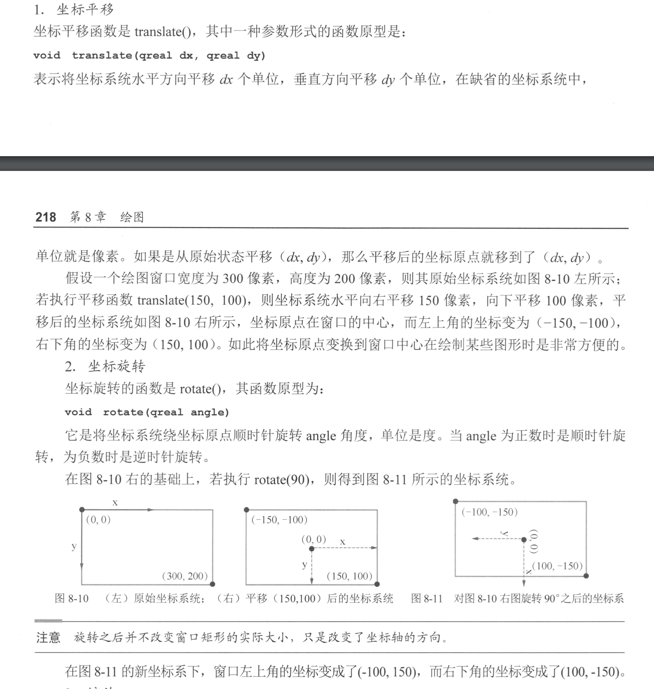
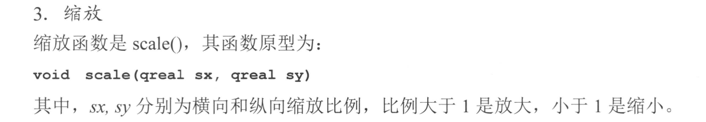
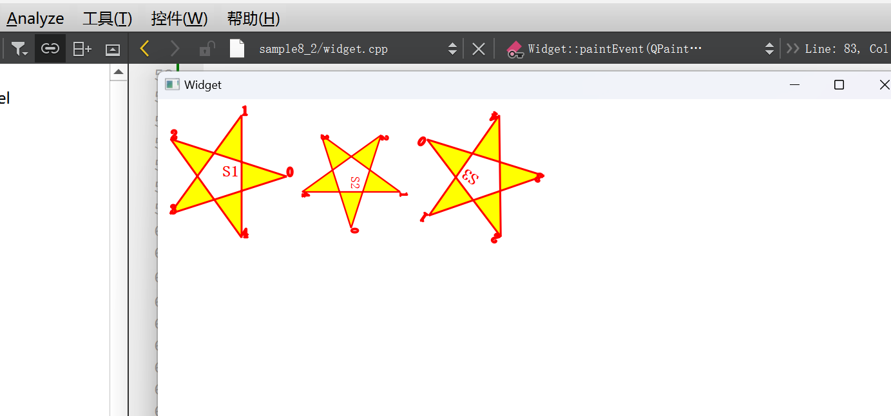

## QPainter绘图系统
### sample8_1
1. 重写 `void paintEvent(QPaintEvent *event)` 事件
2. 设置画布颜色 `setPalette(QPalette(Qt::white))`
3. 创建 QPainter 对象
4. 在中间位置创建 QRect 矩形
5. 设置画笔 QPen 对象
6. QBrush 对象，填充颜色的刷子
7. painter.drawRect(rect); 
```cpp
class Widget : public QWidget
{
protected:
    void paintEvent(QPaintEvent *event) Q_DECL_OVERRIDE;
};
Widget::Widget(QWidget *parent) :QWidget(parent), ui(new Ui::Widget)
{
    ui->setupUi(this);
    setPalette(QPalette(Qt::white));//设置窗口为白色背景
    setAutoFillBackground(true);
    this->resize(400,400);
}
void Widget::paintEvent(QPaintEvent *event)
{
    QPainter painter(this);//创建QPainter对象
    painter.setRenderHint(QPainter::Antialiasing);
    painter.setRenderHint(QPainter::TextAntialiasing);

    int W = this->width(); //绘图区宽度
    int H = this->height(); //绘图区高度
    QRect rect(W/4,H/4,W/2,H/2); //中间区域矩形框
    // 设置画笔
    QPen pen;
    pen.setWidth(3); //线宽
    pen.setColor(Qt::red); //划线颜色
    //Qt::NoPen, Qt::SolidLine, Qt::DashLine, Qt::DotLine, Qt::DashDotLine, Qt::DashDotDotLine, Qt::CustomDashLine
    pen.setStyle(Qt::SolidLine);//线的类型，实线、虚线等

    //Qt::FlatCap, Qt::SquareCap,Qt::RoundCap
    pen.setCapStyle(Qt::FlatCap);//线端点样式

    //Qt::MiterJoin,Qt::BevelJoin,Qt::RoundJoin,Qt::SvgMiterJoin
    pen.setJoinStyle(Qt::BevelJoin);//线的连接点样式
    painter.setPen(pen);

    // 设置画刷
    //    QPixmap texturePixmap(":images/images/texture.jpg");
    QBrush  brush;
    brush.setColor(Qt::yellow); //画刷颜色
    brush.setStyle(Qt::SolidPattern); //画刷填充样式
    painter.setBrush(brush);

    painter.drawRect(rect); 
}
```

#### QPen 的各种样式，需要时直接查阅
```cpp
void setColor(QColor &color) 设置画笔颜色,即线条颜色
void setWidth(int width) 设置线条宽度
void setStyle(Qt::PenStyle style) 设置线条样式,参数为Qt::PenStyle枚举类型
void setCapStyle(Qt::PenCapStyle style) 设置线条端点样式,参数为Qt::PenCapStyle枚举类型
void setJoinStyle(Qt::PenJoinStyle style) 设置连接样式,参数为Qt::PenJoinStyle枚举类型
```

#### QBrush 填充样式，需要时直接查阅
#### sample8_1_brush
```cpp
void Widget::paintEvent(QPaintEvent *event)
{
    QPainter painter(this);//创建QPainter对象
    painter.setRenderHint(QPainter::Antialiasing);
    painter.setRenderHint(QPainter::TextAntialiasing);

    int W = this->width(); //绘图区宽度
    int H = this->height(); //绘图区高度
    QRect rect(W/4,H/4,W/2,H/2); //中间区域矩形框

    QPen pen;
    pen.setWidth(3); //线宽
    pen.setColor(Qt::red); //划线颜色
    pen.setStyle(Qt::SolidLine);//线的类型，实线、虚线等
    pen.setCapStyle(Qt::FlatCap);//线端点样式
    pen.setJoinStyle(Qt::BevelJoin);//线的连接点样式
    painter.setPen(pen);

    // 设置画刷
    QPixmap texturePixmap(":images/ft.jpg");

    QBrush  brush;
    brush.setStyle(Qt::SolidPattern); //画刷填充样式
    painter.setBrush(brush);

    painter.drawRect(rect);
}
```

#### 渐变填充、复杂的数学图形可以直接查看 《QT 5.9 开发手册》8.1.4 8.1.5节

## 坐标系统
原始情况下，窗口左上角为（0，0），右下角为（x，y），水平向右为 正x，垂直向下为 正y。
QT提供改变坐标原点、旋转坐标轴方向、缩放坐标的方法。
文字不方便表述，看图




### sample8_2
和 sample8_1 代码类似，只有 绘图event 的代码修改
```cpp
void Widget::paintEvent(QPaintEvent *event) {
    QPainter painter(this);
    painter.setRenderHint(QPainter::Antialiasing);
    painter.setRenderHint(QPainter::TextAntialiasing);

    QFont font;
    font.setBold(true);
    font.setPointSize(12);
    painter.setFont(font);

    QPen pen;
    pen.setWidth(3);
    pen.setColor(Qt::red);
    pen.setStyle(Qt::SolidLine);
    pen.setCapStyle(Qt::FlatCap);
    pen.setJoinStyle(Qt::BevelJoin);
    painter.setPen(pen);

    QBrush  brush;
    brush.setColor(Qt::yellow);
    brush.setStyle(Qt::SolidPattern);
    painter.setBrush(brush);
// 下面是新增的，上面和之前一样
    // 五角星 5个顶点坐标，原点在星星的中心
    qreal R = 100; // qreal == double
    const qreal PI = 3.14;
    qreal deg = PI *72 / 180;
    QPoint points[] = {
        QPoint(R, 0),
        QPoint(R*std::cos(deg), -R * std::sin(deg)),
        QPoint(R*std::cos(deg*2), -R * std::sin(deg*2)),
        QPoint(R*std::cos(deg*3), -R * std::sin(deg*3)),
        QPoint(R*std::cos(deg*4), -R * std::sin(deg*4)),
    };

    // 设计绘制五角星的PainterPath,以便重复使用
    QPainterPath starPath;
    starPath.moveTo(points[0]);
    starPath.lineTo(points[2]);
    starPath.lineTo(points[4]);
    starPath.lineTo(points[1]);
    starPath.lineTo(points[3]);
    starPath.closeSubpath(); // 闭合路径,最后一个点与第一个点相连
    starPath.addText(points[0], font, "0"); // 显示:端点编号
    starPath.addText(points[1], font, "1");
    starPath.addText(points[2], font, "2");
    starPath.addText(points[3], font, "3");
    starPath.addText(points[4], font,"4");

    painter.save();
    painter.translate(100, 120);
    painter.drawPath(starPath);
    painter.drawText(0, 0, "S1");
    painter.restore();//恢复坐标状态

    painter.translate(300,120);//平移
    painter.scale(0.8,0.8);//缩放
    painter.rotate(90);//顺时针旋转90度
    painter.drawPath(starPath);//画星星
    painter.drawText(0,0, "S2");

    painter.resetTransform();//复位所有坐标变换
    painter.translate(500,120);//平移
    painter.rotate(-145);//逆时针旋转145度
    painter.drawPath(starPath);//画星星
    painter.drawText(0,0, "S3");
}
```

重点片段解释

```cpp
    painter.save();
    painter.translate(100, 120);
    painter.drawPath(starPath);
    painter.drawText(0, 0, "S1");
    painter.restore();//恢复坐标状态
```
第一个五角星，save()函数保存当前坐标状态(也就是坐标的原始状态),然后将坐标原点平移到(100,120),
调用绘制路径的函数drawPath(starPath)绘制五角星,在五角星的中心标注"S1"表示第1个五角星,
最后调用restore()函数恢复上次的坐标状态。这样就以(100,120)为中心点绘制了第1个五角星。

```cpp
    painter.translate(300,120);//平移
    painter.scale(0.8,0.8);//缩放
    painter.rotate(90);//顺时针旋转90度
    painter.drawPath(starPath);//画星星
    painter.drawText(0,0, "S2");
```
这里首先调用坐标平移函数translate(300,120)。由于上次restore()之后回到坐标初始状态,所以这次平移后,坐标原点到了物理坐标(300,120)。而如果没有上一个restore(),会在上一次的坐标基础上平移。
绘图之前调用了缩放函数scale(0.8,0.8),使得缩小到原来的0.8,再顺时针旋转90°,然后调用绘制路径函数drawPath(starPath)绘制五角星,就得到了第22个五角星。
