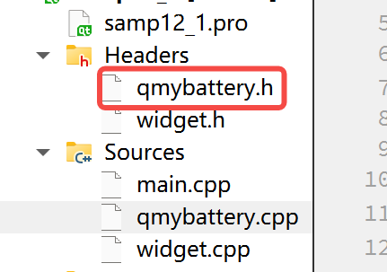
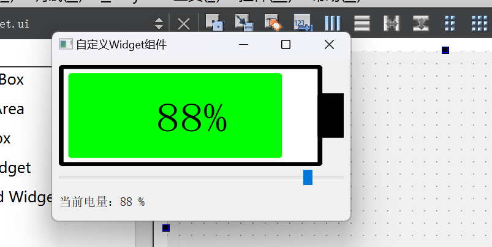

# 自定义 Widget组件
Qt的UI设计器提供了很多GUI设计的界面组件,可以满足常见的的界面设计需求。但是某些时候需要设计特殊的界面组件,而在UI设计器的组件面板里根本没有合适的组件,这时就需要设计自定义的界面组件。
所有界面组件的基类是 QWidget ,要设计自定义的界面组件,可以从QWidget继承一个自定义的类,重定义其paintEvent()事件,利用Qt的绘图功能绘制组件外观,并实现需要的其他功能。

### sample12_1

在一个 基本的 继承自 QWidget 的 项目中，实现 QmyBattery.h 、QmyBattery.cpp
```cpp
// QmyBattery.h 
class QmyBattery : public QWidget
{
    Q_OBJECT
//自定义属性
    Q_PROPERTY(int  powerLevel READ powerLevel WRITE setPowerLevel NOTIFY powerLevelChanged)

private:
    QColor mColorBack=Qt::white;//背景颜色
    QColor mColorBorder=Qt::black;//电池边框颜色
    QColor mColorPower=Qt::green;//电量柱颜色
    QColor mColorWarning=Qt::red;//电量短缺时的颜色

    int mPowerLevel=60;//电量0-100
    int mWarnLevel=20;//电量低警示阈值

protected:
    void paintEvent(QPaintEvent *event) Q_DECL_OVERRIDE; // 这个才是重点，要实现自定义组件，必须继承 QWidget 并 override paintEvent 事件

public:
    explicit QmyBattery(QWidget *parent = 0);

    void setPowerLevel(int pow);//设置当前电量
    int powerLevel();

    void setWarnLevel(int warn);//设置电量低阈值
    int warnLevel();

    QSize sizeHint();//报告缺省大小

signals:
    void   powerLevelChanged(int );

public slots:
};

// QmyBattery.cpp
void QmyBattery::paintEvent(QPaintEvent *event)
{  //界面组件的绘制
    Q_UNUSED(event);

    QPainter    painter(this);
    QRect rect(0,0,width(),height()); //viewport矩形区
    painter.setViewport(rect);//设置Viewport
    painter.setWindow(0,0,120,50); // 设置窗口大小，逻辑坐标
    painter.setRenderHint(QPainter::Antialiasing);
    painter.setRenderHint(QPainter::TextAntialiasing);

//绘制电池边框
    QPen pen;//设置画笔
    pen.setWidth(2); //线宽
    pen.setColor(mColorBorder); //划线颜色
    pen.setStyle(Qt::SolidLine);//线的类型，实线、虚线等
    pen.setCapStyle(Qt::FlatCap);//线端点样式
    pen.setJoinStyle(Qt::BevelJoin);//线的连接点样式
    painter.setPen(pen);

    QBrush  brush;//设置画刷
    brush.setColor(mColorBack); //画刷颜色
    brush.setStyle(Qt::SolidPattern); //画刷填充样式
    painter.setBrush(brush);

    rect.setRect(1,1,109,48);
    painter.drawRect(rect);//绘制电池边框

    brush.setColor(mColorBorder); //画刷颜色
    painter.setBrush(brush);
    rect.setRect(110,15,10,20);
    painter.drawRect(rect); //画电池正极头

    // 画电池柱
    if (mPowerLevel>mWarnLevel)
    {  //正常颜色电量柱
        brush.setColor(mColorPower); //画刷颜色
        pen.setColor(mColorPower); //划线颜色
    }
    else
    { //电量低电量柱
        brush.setColor(mColorWarning); //画刷颜色
        pen.setColor(mColorWarning); //划线颜色
    }
    painter.setBrush(brush);
    painter.setPen(pen);

    if (mPowerLevel>0)
    {
        rect.setRect(5,5,mPowerLevel,40);
        painter.drawRect(rect);//画电池柱
    }

    // 绘制电量百分比文字
    QFontMetrics    textSize(this->font());
    QString powStr=QString::asprintf("%d%%",mPowerLevel);
    QRect textRect=textSize.boundingRect(powStr);//得到字符串的rect

    painter.setFont(this->font());
    pen.setColor(mColorBorder); //划线颜色
    painter.setPen(pen);

    painter.drawText(55-textRect.width()/2, 23+textRect.height()/2, powStr);
}

QmyBattery::QmyBattery(QWidget *parent) : QWidget(parent){}
void QmyBattery::setPowerLevel(int pow)
{ //设置当前电量值
    mPowerLevel = pow;
    emit powerLevelChanged(pow); //触发信号
    repaint();
}
int QmyBattery::powerLevel()
{ //读取当前电量值
    return mPowerLevel;
}
void QmyBattery::setWarnLevel(int warn)
{//设置电量低阈值
    mWarnLevel = warn;
    repaint();
}
int QmyBattery::warnLevel()
{//读取电量低阈值
    return  mWarnLevel;
}
QSize QmyBattery::sizeHint()
{//报告缺省大小,调整比例
    int H = this->height();
    int W = H*12/5;
    QSize size(W, H);
    return size;
}
```
然后，在 widget.cpp 中就可以 通过 ui->QmyBattery 使用自定义组件了！
```cpp
void Widget::on_horizontalSlider_valueChanged(int value)
{
   ui->battery->setPowerLevel(value); // ui->battery 是自定义的组件
   QString  str=QStringLiteral("当前电量：")+QString::asprintf("%d %%",value);
   ui->LabInfo->setText(str);
}
```

