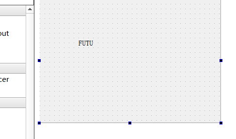
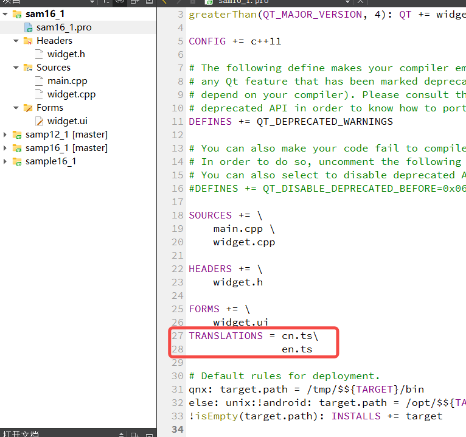
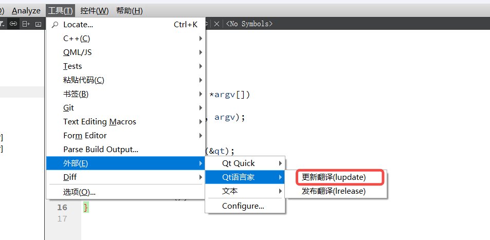
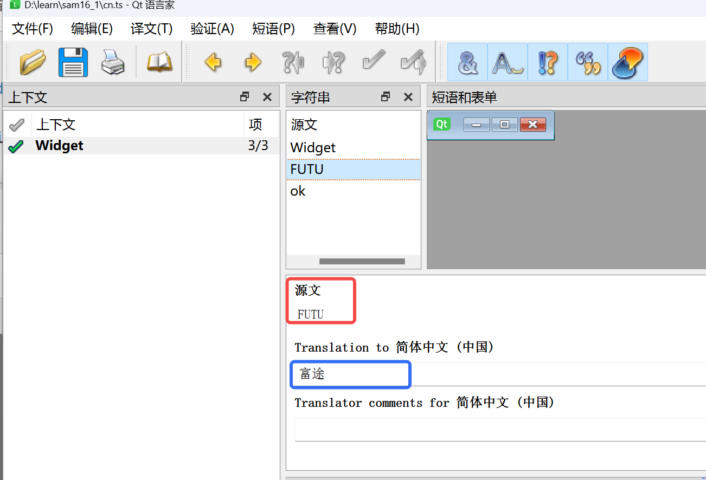
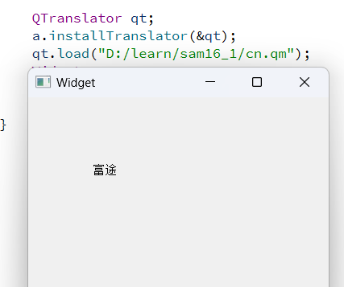

## 多语言界面
### sam16_1

实现一个UI界面，上面有一个 label ， 内有字符串 "FUTU" ，可以选择不同的语言来展示。
项目的名称 Widget 、 Widget.h 、 Widget.cpp 全部都不需要改动。main.cpp 涉及国际化的部分。

1. 首先设计 UI 界面，如图


2. 在 .pro 文件中添加 ts 文件的名称


3. lupdate ts文件，此时会生成 2个ts文件  cn.ts ，en.ts 



4. 使用 linguist.exe 打开 cn.ts 文件 【项目选择的C++编译器版本，比如我选择的是mingw73_64，那就是 D:\QT\5.14.2\mingw73_64\bin\linguist.exe】

蓝色的框里面，填写对应英文的翻译，比如 FUTU --> 富途。
此时会生成 cn.qm en.qm 文件

5. main.cpp 装载 cn.qm en.qm
```cpp
#include "widget.h"
#include <QApplication>
#include <QTranslator>

int main(int argc, char *argv[])
{
    QApplication a(argc, argv);

    QTranslator qt;
    qt.load("D:/learn/sam16_1/cn.qm");  // 显示中文
    // qt.load("D:/learn/sam16_1/en.qm");  显示英文
    a.installTranslator(&qt);

    Widget w;
    w.show();
    return a.exec();
}
```


## 使用样式表自定义界面
## 使用 QStyle 设置界面外观


## 发布程序
Qt的应用程序发布有两种方式:静态链接和共享库方式。

静态链接(Static linking)是指用Qt编译应用程序时,将Qt的运行库等所需的支持文件全部静态编译到应用程序里,生成一个独立的可执行文件,应用程程序发布只需很少的几个文件。这种方式的缺点是应用程序可执行文件很大,缺少灵活性。例如,当应用程序需要更新,或Qt有更新时,需要重新编译应用程序后再发布。而且,静态链接方式不能部署插件。

共享库(Shared Libraries)方式是指按正常方式编译生成应用程序,将应用程序运行所需的各种共享库与应用程序一同发布给用户。这样,当Qt的运行库更新时可以单独更新Qt运行库,应用程序如果使用了插件(插件是以共享库形式存在的),也可以单独更新插件,这为应用程序更新提供了方便。

一般为共享库方式。

### 生成 windows 下的 exe
1. 构建方式由Debug（调试版本）改为Release（发布版本），运行项目，得到 build-项目-Release文件夹
2. 文件夹里的 test.exe 复制粘贴到 一个 空目录，比如 /test
3. 在 test 目录下， cmd输入 windeployqt test.exe【windeployqt需要添加环境变量，一般在D:\QT\5.14.2\mingw73_64\bin】
4. test目录下产生了一些文件，删除windeployqt环境变量，运行 test.exe ，一般会出现 xxx.dll 丢失，一般在D:\QT\5.14.2\mingw73_64\bin 下可以找到，把里面的 xxx.dll 复制粘贴到test目录
5. mingw73_64 或者 msvc2017 根据项目创建时选的编译器版本来决定。