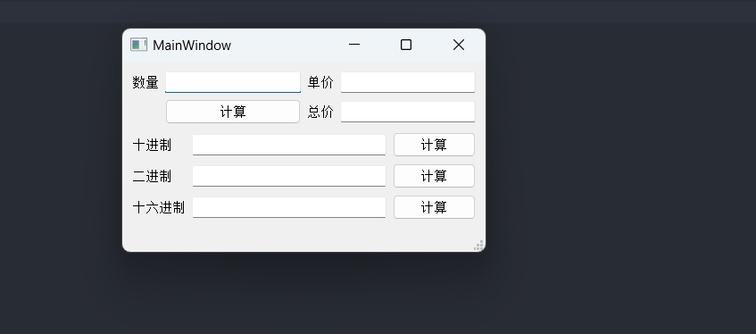
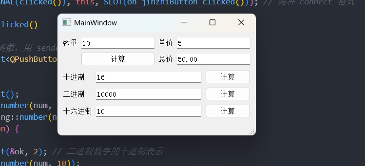
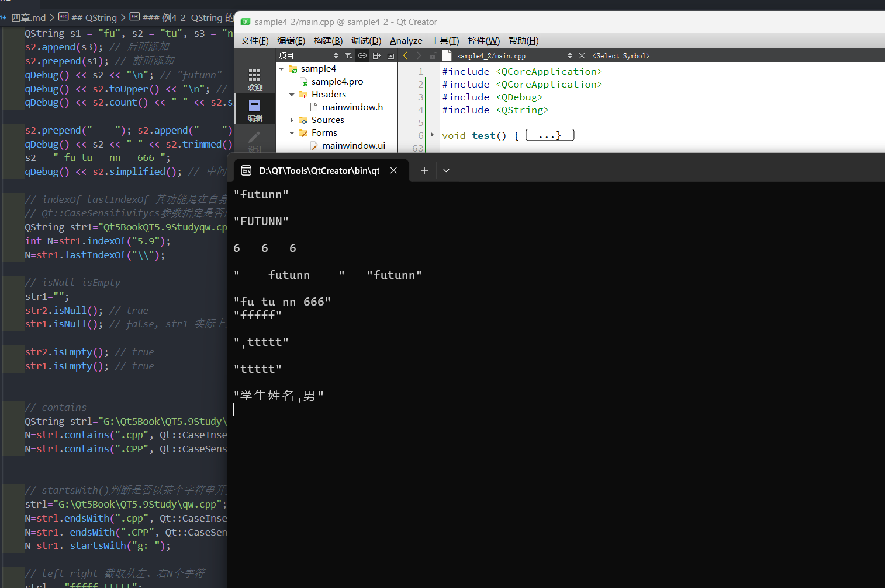

## QString
以例4为例，实现一个简单的计算器，学习 QString 的字符串与进制转换
### 例4


#### UI上半部分：一个计算按钮，ui自动生成槽函数
```cpp
void MainWindow::on_pushButton_clicked()
{
    int num = ui->num->text().toInt(); // QString 转 int
    float price = ui->price->text().toFloat(); // QString 转 float
    float allPrice = num * price;
    ui->allPrice->setText(QString::asprintf("%.2F", allPrice));
}
```

QString 转换 数字类型
```cpp
// 整型
int toInt(bool *ok = Q_NULLPTR, int base = 10) const
long toLong (bool *ok = Q_NULLPTR, int base = 10) const
short toShort (bool *ok = Q NULLPTR, int base = 10) const
uint toUInt (bool *ok = Q_NULLPTR, int base = 10) const
ulong touLong (bool *ok = Q_NULLPTR, int base = 10) const

// 浮点
double toDouble(bool *ok = NULLPTR) const
float toFloat (bool *ok = NULLPTR) const
```

QString 转换 小数点格式 4种
```cpp
QString str;
str=QString::number(total,'f',2);
str=QString::asprintf("%.2f",total);
str=str.setNum(total,'f',2);
str=str.sprintf("%.2f",total); // 在 QT 5.14 中已经为过时方法，不要在用
```

#### UI下半部分：三个计算按钮，绑定到一个槽函数处理
思路：
1. connect 三个语句，关联 3个按钮 + 1个自定义槽函数
2. 槽函数中，利用sender() + qobject_cast 获取 QPushButton* 对象
3. 直接 == 比较对象与哪个按钮相等，则对应那个按钮【设计模式优化，QHash<QPushButton*, function*> 注册器模式， 可以把 if-else语句干掉】
```cpp
MainWindow::MainWindow(QWidget *parent): QMainWindow(parent), ui(new Ui::MainWindow)
{
    ui->setupUi(this);
    connect(ui->tenButton, &QPushButton::clicked, this, &MainWindow::on_jinzhiButton_clicked); // 3个按钮 ui->tenButton ui->twoButton ui->sixteenButton
    connect(ui->twoButton, &QPushButton::clicked, this, &MainWindow::on_jinzhiButton_clicked);
    connect(ui->sixteenButton, SIGNAL(clicked()), this, SLOT(on_jinzhiButton_clicked())); // 两种 connect 格式 
}
void MainWindow::on_jinzhiButton_clicked()
{
    // 三个按钮信号关联到这同一个槽函数，用 sender() 区分信号发射者
    QPushButton *but = qobject_cast<QPushButton *>(sender());
    int num;
    if (but == ui->tenButton) {
        num = ui->ten->text().toInt();
        ui->two->setText(QString::number(num, 2));
        ui->sixteen->setText(QString::number(num, 16).toUpper());
    } else if (but == ui->twoButton) {
        bool ok;
        num = ui->two->text().toInt(&ok, 2); // 二进制数字的十进制表示
        ui->ten->setText(QString::number(num, 10));
        ui->sixteen->setText(QString::number(num, 16).toUpper());
    } else {
        // 同理
    }
}
```
进制转换
int 转 QString字符串的 2进制表示 `QString::number(num, 2)`
int 转 QString字符串的 16进制表示 `QString::number(num, 16).toUpper()`




### 例4_2  QString 的常用函数
各种函数用法直接看例子
```cpp
void test() {
    QString s1 = "fu", s2 = "tu", s3 = "nn";
    s2.append(s3); // 后面添加
    s2.prepend(s1); // 前面添加
    qDebug() << s2 << "\n"; // "futunn"
    qDebug() << s2.toUpper() << "\n"; // "FUTUNN" toLower()
    qDebug() << s2.count() << " " << s2.size() << " " << s2.length() << "\n"; // 6   6   6

    s2.prepend("    "); s2.append("    ");
    qDebug() << s2 << " " << s2.trimmed() << "\n"; // "    futunn    "   "futunn" trimmed去掉首尾空格
    s2 = " fu tu   nn   666 ";
    qDebug() << s2.simplified(); // 中间连续空格替换为1个空格 "fu tu nn 666"

    // indexOf lastIndexOf 其功能是在自身字符串内查找参数字符串 str出现的位置,参数from是开始查找的位置
    // Qt::CaseSensitivitycs参数指定是否区分大小写。
    QString str1="Qt5BookQT5.9Studyqw.cpp", str2;
    int N=str1.indexOf("5.9");
    N=str1.lastIndexOf("\\");

    // isNull isEmpty
    str1="";
    str2.isNull(); // true
    str1.isNull(); // false, str1 实际上是 "\0" 所以非NULL

    str2.isEmpty(); // true
    str1.isEmpty(); // true


    // contains
    QString strl="G:\Qt5Book\QT5.9Study\qw.cpp";
    N=strl.contains(".cpp", Qt::CaseInsensitive); // 不区分大小写, 默认是不区分
    N=strl.contains(".CPP", Qt::CaseSensitive); // 区分大小写


    // startsWith()判断是否以某个字符串开头,endsWith()判断是否容以某个字符串结束。
    strl="G:\Qt5Book\QT5.9Study\qw.cpp";
    N=strl.endsWith(".cpp", Qt::CaseInsensitive);
    N=str1. endsWith(".CPP", Qt::CaseSensitive);
    N=str1. startsWith("g: ");

    // left right 截取从左、右N个字符
    strl = "fffff,ttttt";
    qDebug() << strl.left(strl.indexOf(",")) << "\n"; // fffff
    qDebug() << strl.right(strl.size() - strl.lastIndexOf(",")) << "\n"; // ,ttttt
    qDebug() << strl.right(strl.size() - strl.lastIndexOf(",") - 1) << "\n"; // ttttt 注意细节-1

    // section 应该是这些例子里面最有用的
    // section(const QSting &sep, start, end=-1)
    // 以 sep 为分隔符，截取 s 到 e 的字符串
    strl="学生姓名,男,1984-3-4,汉族,山东";
    str2=strl.section (",",0,0); //"学生姓名" 第一段编号为0

    str2=strl.section (",",1,1); //"男"
    str2=strl.section (",",0,1); //"学生姓名,男"
    qDebug() <<  str2;
    str2=str1.section (",",4,4); //"山东"
}
```
